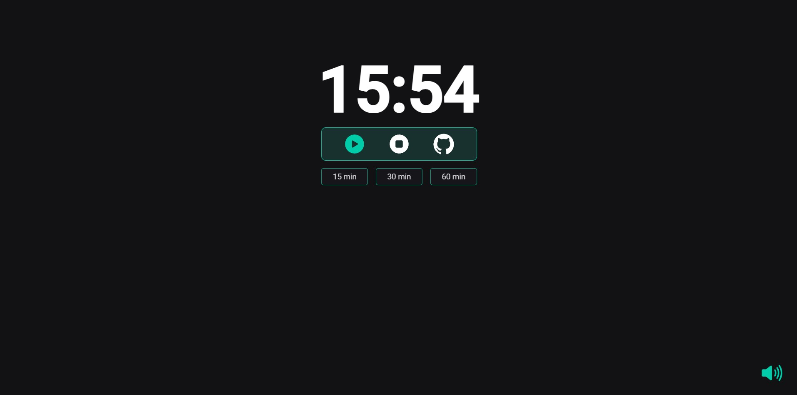

# LoFi Pomodoro 🎵

Pomodoro timer with a LoFi music player created with HTML, CSS and JavaScript.

This application implements the pomodoro technique and tells the user exactly when to work and when to take a break.

The pomodoro process:

- Start a 30-minute timer or (customize time)
- Work until the timer rings
- Listen to relaxing music that helps you focus

The user is able to use the music player to play lofi songs during the pomodoro sessions and breaks.

This project was a great way to learn more about the HTML5 Audio API and to practice JavaScript topics like DOM manipulation, event listeners, and timer functions.

  

## 🔗 Link

- [Live Demo](https://gabezin.github.io/Lo-fi-Focus/)

## 🛠️ Technologies

- HTML
- CSS
- JavaScript

## 💡 Features

Pomodoro

- User is able to set the timer to pomodoro mode, short break, or long break.
- Pomodoro: 30 minutes or Customize time
- User can stop and start the timer
- Audio notification at the end of a timer period

Music Player

- Play and Mute Lofi Song

## 📚 Useful resources

- The royalty free music used in this project was collected from [Track title - Provided by Lofi Girl](https://www.youtube.com/watch?v=i43tkaTXtwI)

## 👩🏻‍💻 Author

##### Made with 💜 by Daniel Gabriel
